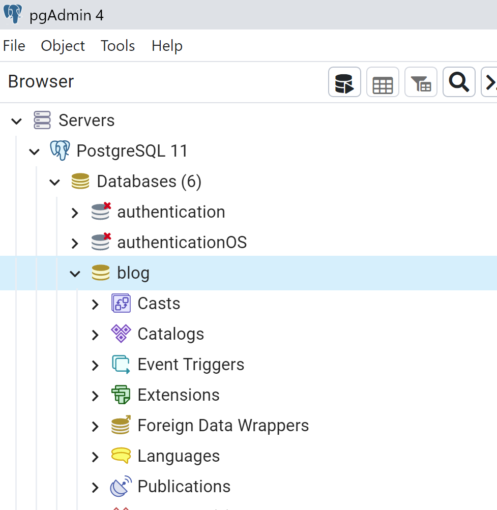
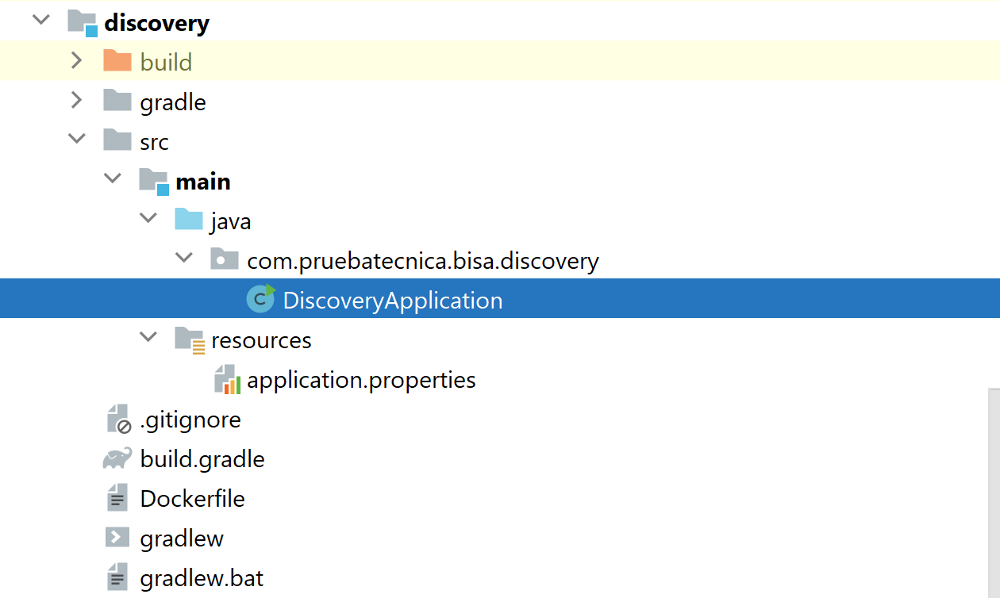
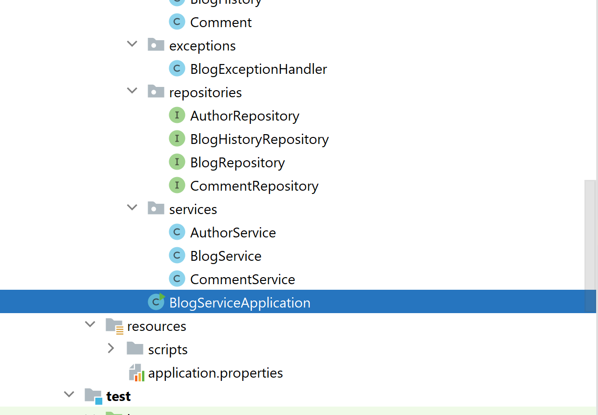

# 📝 Blog APIs REST - Spring Boot

> Backend REST API para un blog, permitiendo gestionar autores, blogs y comentarios.  
## Reseña de la Estrategia y Tecnologías Utilizadas

La solución está diseñada bajo una arquitectura **RESTful** utilizando **Spring Boot 2.x**, permitiendo separar claramente las responsabilidades entre capas de **controllers**, **services**, **repositories** y **entities**. Esta separación facilita el mantenimiento, la escalabilidad y las pruebas unitarias.  

Para la persistencia de datos se utiliza **Spring Data JPA** junto con **Hibernate**, lo que permite mapear las entidades de negocio (`Author`, `Blog`, `Comment`) a tablas de la base de datos relacional (MySQL o H2 para pruebas). Las relaciones entre entidades están claramente definidas, incluyendo `@OneToMany` y `@ManyToOne`, garantizando integridad y facilidad de consultas.  

Los **DTOs** (`AuthorDto`, `BlogDto`, `CommentDto`) y los **request objects** (`CreateAuthorRequest`, `CreateBlogRequest`, etc.) permiten desacoplar la capa de presentación de la capa de persistencia, evitando problemas de serialización y facilitando el manejo de la información entre el cliente y el servidor.  

Se implementa **manejo global de excepciones** mediante `@ControllerAdvice` para capturar errores de validación, deserialización y errores de negocio, asegurando respuestas consistentes y claras para los consumidores de la API.  

Para la documentación y pruebas de la API se utiliza **Swagger 2 (Springfox)**, lo que permite visualizar los endpoints, modelos y sus interacciones de manera interactiva.  

Se incorpora **validación de campos** con anotaciones de JSR-303 (`@NotBlank`, `@Email`, `@Min`, `@Max`) para garantizar que los datos ingresados cumplan con los requisitos antes de persistirlos en la base de datos.  

En resumen, la solución combina **Spring Boot**, **Spring Data JPA**, **DTOs**, **Swagger**, y buenas prácticas de arquitectura en capas, proporcionando una implementación robusta, mantenible y escalable para la gestión de blogs y comentarios.

---

## 📌 Tabla de Contenidos

- [Descripción](#descripción)  
- [Tecnologías](#tecnologías)  
- [Instalación](#instalación)  
- [Configuración](#configuración)  
- [Estructura del proyecto](#estructura-del-proyecto)  
- [Endpoints](#endpoints)  
- [DTOs y Requests](#dtos-y-requests)  
- [Manejo de excepciones](#manejo-de-excepciones)  
- [Swagger / Documentación](#swagger--documentación)  
 

---

## 🔹 Descripción

Esta API permite:  

- Crear, listar y actualizar **Autores**  
- Crear, listar y actualizar **Blogs**  
- Agregar y listar **Comentarios**  
- Mantener histórico de actualizaciones de blogs  
- Validar entradas y manejar errores de forma consistente  

---

## ⚙️ Tecnologías

- Java 17  
- Spring Boot 2.x  
- Spring Data JPA / Hibernate  
- H2 / postgreSQL
- Lombok  
- Swagger 2 (Springfox)  
- Gradle 

---

## 🚀 Instalación

1. Clona el repositorio:

```bash
git clone https://github.com/marcorios26/pruebatecnicadesarolladorsolucionesbackend.git
```
2. Abrir el proyecto Backend con tu IDE de preferencia

3. Una vez abierto las dependencias se cargaran automaticamente
4. Seguir el paso en [Configura el archivo application.properties](#configura-el-archivo-applicationproperties)
5. Crear la Base de datos "blog" en pgAdmin.

5. Ejecutar el servicio Discovery 

6. Una vez levenatado el servicioo Discovery levantar el Servicio Blog


##  Configura el archivo application.properties
```bash
# Application Properties
server.port=8763
spring.application.name=blog
# Eureka Client Properties
eureka.client.serviceUrl.defaultZone=http://localhost:8761/eureka
eureka.client.fetchRegistry= true
# PostgreSQL Properties
spring.datasource.url=jdbc:postgresql://localhost:5432/blog
spring.datasource.username=postgres #colocar credenciales segun corresponda
spring.datasource.password=pass123 #colocar credenciales segun corresponda
# Default data config
spring.sql.init.mode= always
#spring.sql.init.data-locations=${SCRIPTS_PATH:classpath:/scripts/data.sql}

spring.jpa.hibernate.ddl-auto=update
spring.jpa.properties.hibernate.dialect=org.hibernate.dialect.PostgreSQLDialect
spring.jpa.show-sql=true

spring.mvc.pathmatch.matching-strategy = ANT_PATH_MATCHER
spring.profiles.active= local
path.gateway=http://localhost:8762

```
## Endpoints
Endpoints
Autores
```bash
GET /api/v1/authors → Listar todos los autores

POST /api/v1/authors → Crear un autor (CreateAuthorRequest)
```
Ejemplo de request:
```bash
{
  "firstName": "Marco",
  "lastName": "Rios",
  "secondLastName": "Ramos",
  "birthday": "1990-12-12",
  "residenceCountry": "Bolivia",
  "email": "marco@example.com"
}
```
Blogs
```bash
GET /api/v1/blogs → Listar todos los blogs

GET /api/v1/blogs/{id} → Obtener blog por id

POST /api/v1/blogs → Crear un blog (CreateBlogRequest)

PUT /api/v1/blogs/{id} → Actualizar un blog (UpdateBlogRequest)
```
``` bash
Ejemplo de CreateBlogRequest:

{
  "authorId": 1,
  "content": "Contenido del blog",
  "periodicity": "Mensual",
  "title": "Mi primer blog",
  "topic": "Tecnología",
  "allowComments": true
}
```
Comentarios
``` bash
POST /api/comments → Crear un comentario (CreateCommentRequest)

GET /api/comments/{blogId} → Listar comentarios de un blog
```
Ejemplo de CreateCommentRequest:
``` bash
{
  "content": "Excelente publicación!",
  "writerName": "Juan Perez",
  "writerEmail": "juan@example.com",
  "writerPunctuation": 8,
  "blogId": 1
}
```
## Dtos y Request
``` bash
DTOs: AuthorDto, BlogDto, CommentDto
```
```bash
Requests: CreateAuthorRequest, CreateBlogRequest, CreateCommentRequest, UpdateBlogRequest
```
## Manejo de Excepciones
Validaciones de campos usando @Valid, @NotBlank, @Email, @Min/@Max

Errores de deserialización (ej: formato incorrecto de LocalDate)

@ControllerAdvice global para capturar excepciones y devolver un JSON consistente:
```bash
{
  "status": 400,
  "message": "Invalid format for field 'birthday'. Expected type: LocalDate",
  "timestamp": "2025-09-06T15:05:35.3457509"
}
```
## Estructura del Proyecto
```bash
src/main/java
├─ com.pruebatecnica.bisa.blog
│  ├─ controllers        # Endpoints HTTP
│  ├─ services           # Lógica de negocio
│  ├─ repositories       # Interfaces JPA
│  ├─ dtos               # Objetos de transferencia de datos
│  ├─ apis               # Requests para crear/actualizar entidades
│  ├─ entities           # Clases mapeadas a BD
│  └─ exceptions         # Manejo de errores global
```
## Swagger / Documentación
```bash
Swagger disponible en: http://localhost:8763/v2/api-docs
```